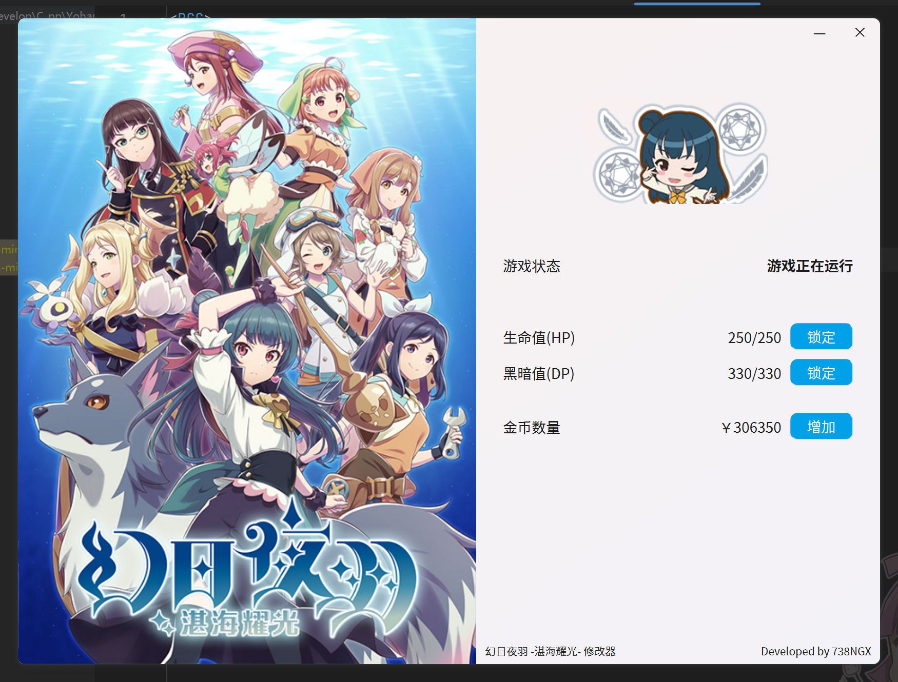

# 幻日夜羽 -湛海耀光- 修改器

《幻日夜羽》是《Love Live!》系列第2部《Love Live! Sunshine!!》的官方衍生作品。本作则是以夜羽的世界为舞台的探索型2D动作游戏《幻日夜羽 -湛海耀光-》。玩家要化身主角“夜羽”，与搭档“莱拉普斯”一起探索怪物横行的神秘海底地城，以救出失踪的同伴为目标前进。


### 开发背景

在某个实在闲着无聊的下午尝试在steam库里找游戏玩,但是手头轻薄本也玩不了啥,最后选了这个去年交了水费但是因为水平太菜一直打不下去的游戏.事实证明该打不下去还是打不下去,网上找了一下也没有(小众粉丝向游戏怎么可能有)别人做好的修改器,于是最终决定自己手搓一个.

整体的开发过程大致是用Cheat Engine先找到几个关键属性(HP,DP的值以及上限值;持有金币)的基址和指针偏移量(如下面代码块所示),然后利用QT搭建一个简易的UI界面来实现.

```C++
#define PLAYER_POINT_BASE_ADDR1     0x115D694
#define PLAYER_POINT_BASE_ADDR2     0x0115B498
#define PLAYER_COINS_BASE_ADDR      0x0166B418

#define HP_VALUE_OFFSETS    { 0x28, 0x38, 0x1E0, 0x8, 0x238, 0x0, 0x10, 0x10, 0x0, 0x20, 0x58, 0x28 }
#define HP_LIMIT_OFFSETS    { 0x28, 0x38, 0x1E0, 0x8, 0x238, 0x0, 0x10, 0x10, 0x0, 0x20, 0x58, 0x2C }
#define DP_VALUE_OFFSETS    { 0x28, 0x38, 0x1E0, 0x8, 0x238, 0x0, 0x10, 0x8, 0x20, 0x58, 0x30 }
#define DP_LIMIT_OFFSETS    { 0x28, 0x38, 0x1E0, 0x8, 0x238, 0x0, 0x10, 0x10, 0x0, 0x20, 0x58, 0x34 }
#define COINS_OFFSETS       { 0x51050 }
```

### 界面&功能介绍

UI界面用原生QT6完成,第一次写这个,比较简陋.



整体功能包括:

- 检测游戏是否正在运行;
- 将HP,DP值锁定在999(无敌状态);
- 增加玩家持有的金币数量以便购买道具;

没有其他修改功能主要是因为CE搜不到地址,似乎不是常规的四字节数存储.另外游戏启动和点击按钮时还有语音音效,请留意.

### 使用说明

#### 使用编译完的版本

直接在[Release页面](https://github.com/738NGX/Yohane-Modifier/releases)下载即可.

#### 自行构建

作者使用的开发环境为CLion 2024.2.3+QT 6.8.0,不保证其他版本的兼容性.

如果编译结束后运行exe出现dll缺失或者无法定位程序入点等bug,请尝试运行`windeployqt6.exe`来修复.方式为在cmd或powershell中输入以下指令:

```shell
windeployqt6.exe的路径 编译生成的Yohane_Modifier.exe路径
```

例如:

```shell
"D:\Qt\6.8.0\mingw_64\bin\windeployqt6.exe" "D:\Develop\C_pp\Yohane-Modifier\cmake-build-debug-mingw\Yohane_Modifier.exe"
```

将会自动进行修复,随后应该可以正常运行exe程序.
